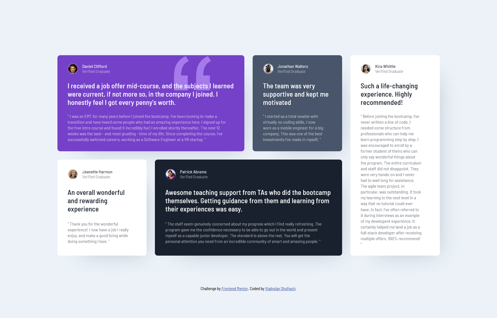

# Frontend Mentor - Testimonials grid section solution

This project is a solution to the [Testimonials grid section challenge on Frontend Mentor](https://www.frontendmentor.io/challenges/testimonials-grid-section-Nnw6J7Un7). Frontend Mentor provides a variety of challenges to help developers practice and improve their coding skills by working on real-world projects. This challenge was a great opportunity to improve my HTML, CSS, and responsive design abilities.

## Table of contents

- [Overview](#overview)
  - [The challenge](#the-challenge)
  - [Screenshot](#screenshot)
  - [Links](#links)
- [My process](#my-process)
  - [Built with](#built-with)
  - [What I learned](#what-i-learned)
- [Author](#author)

## Overview

### The challenge

Users should be able to:

- View the optimal layout for the site depending on their device's screen size

### Screenshot

Here is a screenshot of the project displayed on a desktop screen.



### Links

- Solution URL: [Add solution URL here](https://your-solution-url.com)
- Live Site URL: [Add live site URL here](https://your-live-site-url.com)

## My process

### Built with

- Semantic HTML5 markup
- CSS custom properties
- Flexbox
- CSS Grid
- Mobile-first workflow
- SCSS

### What I learned
During this project, I learned how to use CSS Grid, which is a great tool for making web pages look good on all kinds of devices. It helped me create layouts that change based on the screen size.

#### For Tablet Screens
For medium screens like tablets, I used the following CSS settings to create a simple, flexible grid layout:

```css
grid-template-columns: 1fr 1fr;
grid-template-rows: 1fr 1fr 1fr 1fr;
grid-template-areas:
    "card-1 card-1"
    "card-2 card-3"
    "card-4 card-3"
    "card-4 card-5";
```
This setup arranged the testimonial cards into two columns. I made sure each card went into a specific grid area using the `grid-area` property:

```css
.testimonial:nth-child(1) { grid-area: card-1; }  /* Daniel Clifford */
.testimonial:nth-child(2) { grid-area: card-2; }  /* Jonathan Walters */
.testimonial:nth-child(4) { grid-area: card-3; }  /* Patrick Abrams */
.testimonial:nth-child(5) { grid-area: card-4; }  /* Kira Whittle */
.testimonial:nth-child(3) { grid-area: card-5; }  /* Jeanette Harmon */
```
This layout ensured that the testimonials looked neat and tidy on the tablet screens.

#### For Larger Screens
For bigger screens, I expanded the grid to use more of the available space and make the testimonials look more spread out. I used a grid with four columns and two rows, like this:

```css
grid-template-columns: 1fr 1fr 1fr 1fr;
grid-template-rows: 17.4rem 17.4rem;
grid-template-areas:
    "card-1 card-1 card-2 card-3"
    "card-4 card-5 card-5 card-3";
```
This arrangement made the layout look more spacious and organised on larger screens.

## Author

- Frontend Mentor - [Vladyslav Shulhach](https://www.frontendmentor.io/profile/vladyslav-shulhach)

